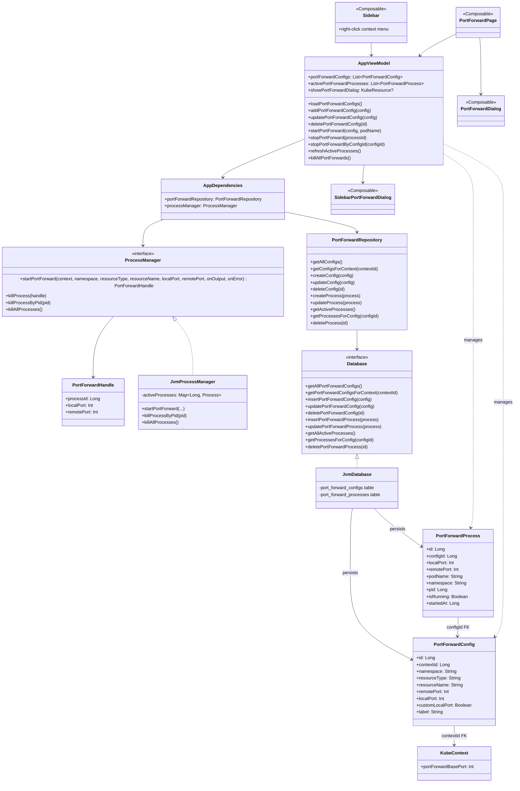
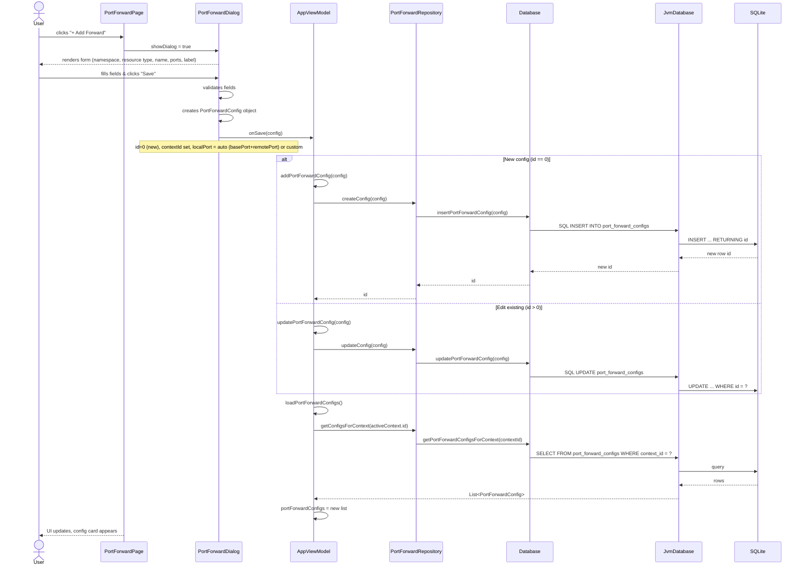
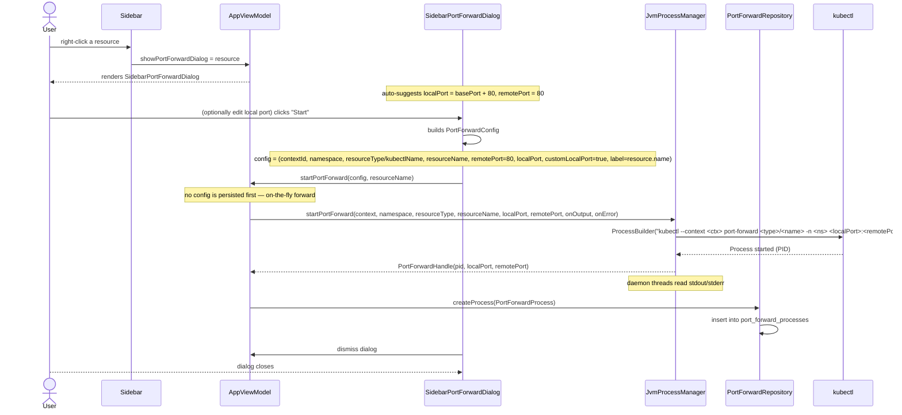
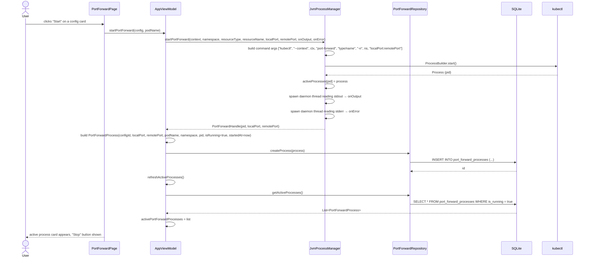
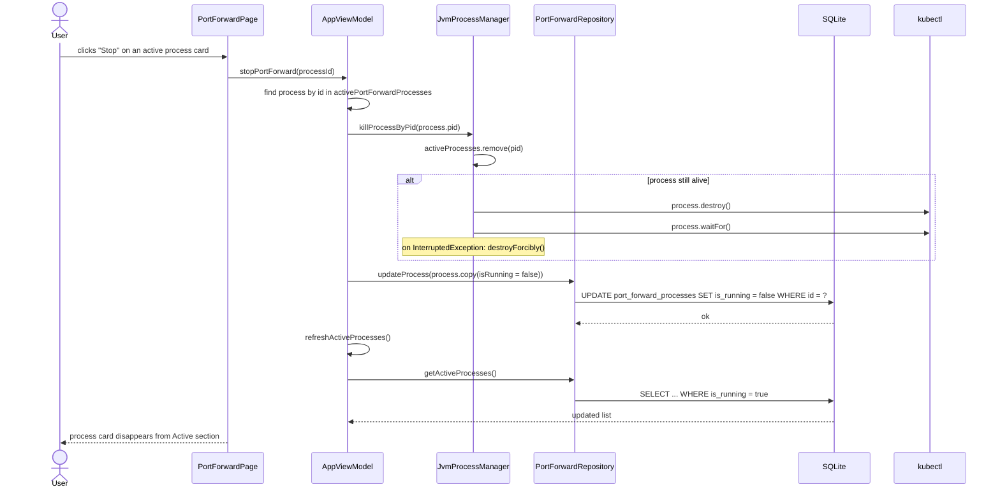
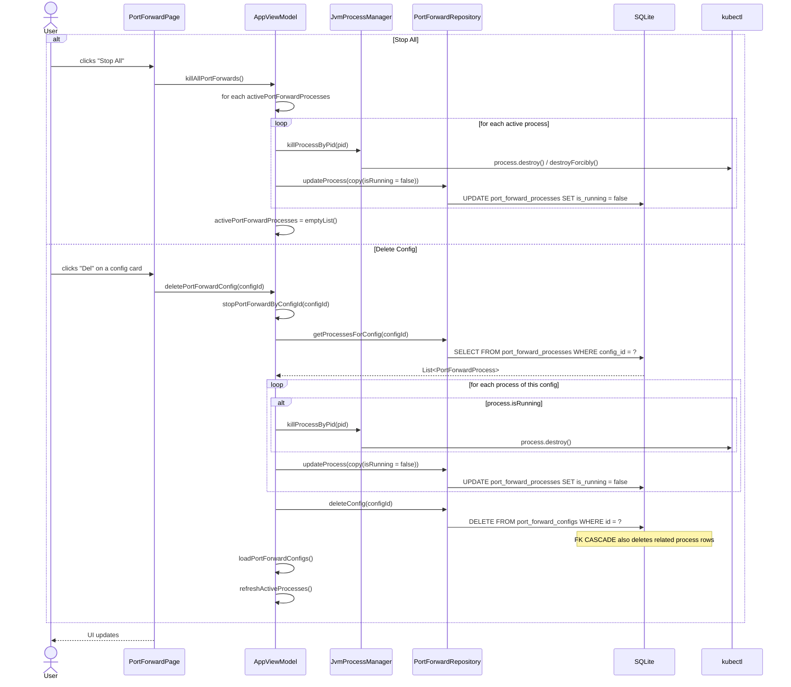

# Port Forwarding — Architecture & Sequence Diagrams

## 1. Class Diagram

---

## 2. Sequence: Create Config (from PortForwardPage)

---

## 3. Sequence: Quick Port Forward from Sidebar

---

## 4. Sequence: Start Port Forward (from Saved Config)

---

## 5. Sequence: Stop Port Forward

---

## 6. Sequence: Stop All / Delete Config

---

## Summary of Key Interactions

| Action | Trigger | ViewModel Method | ProcessManager | DB Write | DB Read |
|--------|---------|-----------------|---------------|----------|---------|
| Create config | Dialog Save | `addPortForwardConfig` | — | INSERT config | loadConfigs |
| Update config | Dialog Save (edit) | `updatePortForwardConfig` | — | UPDATE config | loadConfigs |
| Quick forward | Sidebar right-click → Start | `startPortForward` | `startPortForward` (spawn kubectl) | INSERT process | refresh |
| Start forward | Config card "Start" | `startPortForward` | `startPortForward` (spawn kubectl) | INSERT process | refresh |
| Stop forward | Process card "Stop" | `stopPortForward` | `killProcessByPid` | UPDATE process.isRunning=false | refresh |
| Stop all | "Stop All" button | `killAllPortForwards` | `killProcessByPid` × N | UPDATE each | — |
| Delete config | Config card "Del" | `deletePortForwardConfig` | `killProcessByPid` × N | UPDATE process, DELETE config | reload configs |
