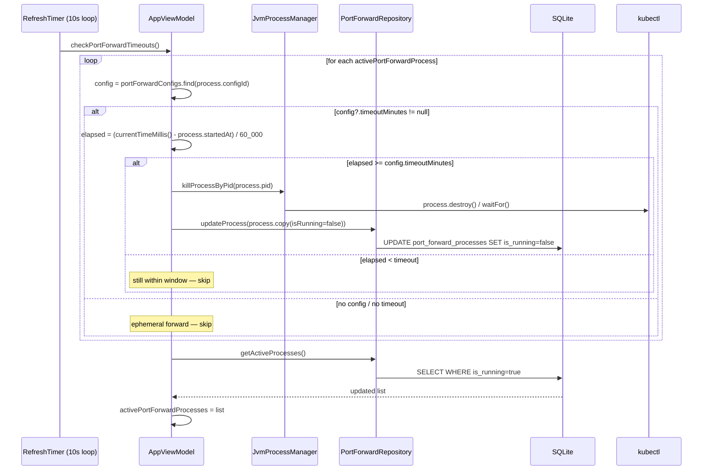

# Port Forward — Design Spec & Implementation Plan

## Feature 1: Auto-assign local ports to avoid conflicts

### Current behavior
Auto mode uses `basePort + remotePort` with no conflict check. Two configs with the same remote port get the same local port.

### Algorithm
```
findAvailableLocalPort(contextId, desiredPort):
  usedPorts = all configs' localPort (for this context) + all active processes' localPort
  port = desiredPort
  while port is in usedPorts: port++
  return port
```

### Sequence

```mermaid
sequenceDiagram
    actor User
    participant Dialog as PortForwardDialog
    participant VM as AppViewModel
    participant Repo as PortForwardRepository
    participant DB as SQLite

    User->>Dialog: types remotePort = 8080
    Dialog->>VM: findAvailableLocalPort(contextId, basePort+8080)
    VM->>VM: usedPorts = portForwardConfigs.localPort<br/>+ activePortForwardProcesses.localPort
    VM->>VM: port = basePort+8080; while port in usedPorts → port++
    VM-->>Dialog: freePort (e.g., 16081)
    Dialog-->>User: shows computed port (read-only in auto mode)
    User->>Dialog: fills fields + clicks Save
    Dialog->>VM: onSave(config) — config.localPort = freePort
    VM->>Repo: createConfig(config)
    Repo->>DB: INSERT port_forward_configs (local_port=freePort, ...)
```

### Files to change

| File | Change |
|------|--------|
| `AppViewModel.kt` | Add `findAvailableLocalPort(contextId, desiredPort): Int` — scans in-memory configs + active processes, returns first free port >= desiredPort |
| `PortForwardPage.kt` | `PortForwardDialog`: when auto mode, call `findAvailableLocalPort` reactively whenever remotePort/basePort changes; make localPort text field read-only in auto mode. Bug fix: pass `contextId` from active context so new configs get the right `contextId` (currently defaults to 0) |
| `App.kt` | `SidebarPortForwardDialog`: use `viewModel.findAvailableLocalPort()` instead of hardcoded `basePort + 80` |

---

## Feature 2: Auto-stop port forwards after timeout

### Design decisions

| Decision | Value |
|----------|-------|
| Timeout storage | `timeoutMinutes: Int?` on `PortForwardConfig` (null = no auto-stop) |
| Timer mechanism | Piggyback on existing 10-second `startRefreshTimer()` loop |
| Sidebar quick-forwards | No persisted config → no timeout → manually stopped only |
| Editing running config timeout | New timeout applies to running processes on next timer tick |

### DB migration

```sql
ALTER TABLE port_forward_configs ADD COLUMN timeout_minutes INTEGER
```

Wrapped in `try/catch` (or check `PRAGMA table_info` first) to handle databases that already have the column.

### Sequence



### Files to change

| # | File | Change |
|---|------|--------|
| 1 | `PortForwardConfig.kt` | Add `val timeoutMinutes: Int? = null` field |
| 2 | `JvmDatabase.kt` | (a) Add column migration in `createTables()` — `ALTER TABLE ... ADD COLUMN timeout_minutes INTEGER` with duplicate-column guard. (b) Update INSERT/UPDATE/SELECT queries for `port_forward_configs` to include `timeout_minutes` |
| 3 | `PortForwardRepository.kt` | No changes (thin pass-through) |
| 4 | `AppViewModel.kt` | Add `checkPortForwardTimeouts()` — for each active process lookup its config; if timeout elapsed → `stopPortForward(process.id)`. Call in `startRefreshTimer()` loop after `refreshActiveContextData()` |
| 5 | `PortForwardPage.kt` | `PortForwardDialog`: add timeout dropdown (None / 5 min / 10 min / 15 min / 30 min / 60 min). `PortForwardConfigCard`: show timeout indicator and countdown for running processes |
| 6 | `App.kt` | No changes (Sidebar quick-forwards have no timeout) |
| 7 | `STATUS.md` | Mark both items as done |

---

## Implementation Order

| Step | Feature | Files | Effort |
|------|---------|-------|--------|
| 1 | Bug fix: pass `contextId` to PortForwardDialog | `PortForwardPage.kt` | Small |
| 2 | Add `findAvailableLocalPort` to ViewModel | `AppViewModel.kt` | Small |
| 3 | Wire auto-port into PortForwardDialog | `PortForwardPage.kt` | Small |
| 4 | Wire auto-port into SidebarPortForwardDialog | `App.kt` | Small |
| 5 | Add `timeoutMinutes` to model + DB schema + migration | `PortForwardConfig.kt`, `JvmDatabase.kt` | Medium |
| 6 | Add `checkPortForwardTimeouts()` + wire into timer | `AppViewModel.kt` | Small |
| 7 | Add timeout field to PortForwardDialog | `PortForwardPage.kt` | Small |
| 8 | Show timeout on PortForwardConfigCard (with countdown) | `PortForwardPage.kt` | Small |
| 9 | Update STATUS.md | `STATUS.md` | Small |
| 10 | Run `./gradlew :shared:jvmTest` | Terminal | Verify |
